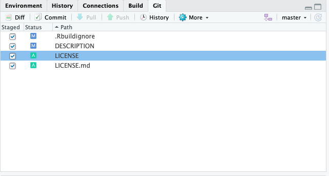
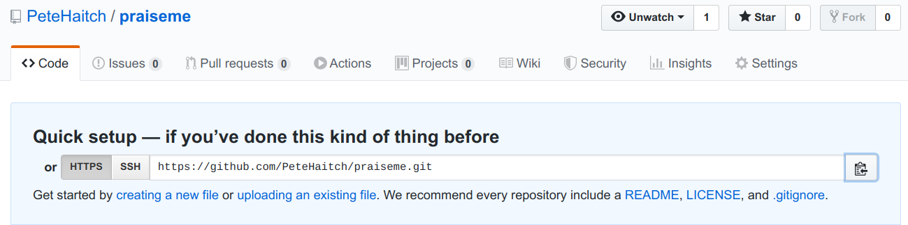
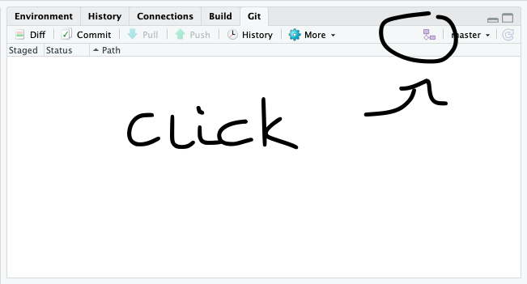

```{r setup, include=FALSE}
knitr::opts_chunk$set(echo = TRUE)
library(emo)
```

*Disclaimer: Most of this material is shamelessly copied or adapted from the 
[Bioconductor How-to-Guide](https://bioconductor.org/developers/how-to/) and 
[Hadley Wickham's book on R packages](http://r-pkgs.had.co.nz/). Other sources 
are mentioned in the text.*

## What, why, who, when and how

### What is a Bioconductor package `r emo::ji("package")`?

A Bioconductor package is an R package `r emo::ji("package")` that provides tools
`r emo::ji("hammer")` for the analysis and 
comprehension of high-throughput genomic data and is available on the 
Bioconductor repository. Like any R package `r emo::ji("package")` , Bioconductor package bundle
together code (in functions), data, documentation and tests in order to share 
these with others. Broadly speaking in Bioconductor, there are packages `r emo::ji("package")` are of 
three main types:

* Annotation: Data-base like packages `r emo::ji("package")` that provide information linking 
    identifiers to other information
* Experiment data: Provide data sets that are used to illustrate particular
    analyses.
* Software: Provide implementation of algorithms, access to resources or 
    visualizations.
* Workflow: Long-form vignettes that illustrate how to analyse a particular 
    type of data, such as RNA-seq.

For the purposes of this workshop, we will only consider software packages.

### Why make a Bioconductor package `r emo::ji("package")`?

Bioconductor packages `r emo::ji("package")` provide a simple way to distribute R code and 
documentation related to analysis and comprehension of high throughput genomic 
data. Packages on Bioconductor `r emo::ji("package")` are basically guaranteed to be installable, 
as they are regularly built, installed, and tested on multiple systems. They are
also required to be high-quality, well maintained and thoroughly documented. By 
creating such a package and making it available via Bioconductor, you are 
contributing to open science. Open science is a movement that tries to ensure
that all aspects of the scientific process, which includes software, are 
accessible. This ensures reproducible research and increases efficiency by reducing
replication of work.

Besides these lofty reasons for making a Bioconductor package `r emo::ji("package")`, being the creator
and maintainer of a Bioconductor package `r emo::ji("package")` is good for your career. It increases
the reach and significance of your work, as it allows other scientists `r emo::ji("biologist")` to make
direct use of your research. 

### Who should make Bioconductor packages `r emo::ji("package")`?

Absolutely anyone with some R programming experience can make a Bioconductor 
package `r emo::ji("package")`.

### When should I make a Bioconductor packages `r emo::ji("package")`?

You are probably ready to make a Bioconductor package `r emo::ji("package")` when you have a set
of cohesive functions that address one or multiple problems in the analyses or
comprehension of high-throughput genomic data. It is important that your 
package `r emo::ji("package")` does not merely present an alternative to existing solutions, but 
constitutes an advance. However, do not be discouraged if your idea is already
implemented. In such cases consider approaching the author of the package that
has implemented your work and offer to collaborate `r emo::ji("coder")` and help maintain their 
package.

### How do I make a Bioconductor package `r emo::ji("package")`?

Well it all starts with an R package `r emo::ji("package")`. This will be the main focus of the rest
of the workshop.

## Design principles for Bioconductor packages `r emo::ji("package")`

### Reuse

There are 1,823 software packages on Bioconductor packages `r emo::ji("package")` currently available. 
Many of these packages `r emo::ji("package")` have implemented thoughtful data structures and built
infrastructure around these. In particular, the 
[Bioconductor Core Team](https://bioconductor.org/about/core-team/) have spent 
considerable resources designing and developing well-tested packages `r emo::ji("package")` that are 
central to the Bioconductor project. It is vital that your package makes use of 
these data structures and infrastructures whenever possible. For example, 
high-throughput genomic data is commonly stored in the `SummarizedExperiment` 
object class. If your package makes use of such data, you should consider 
interoperating with the `SummarizedExperiment` package. Here is a list of core
packages that you should try to incorporate if appropriate:

* [`GenomicRanges`](https://bioconductor.org/packages/GenomicRanges) when using
    genomic coordinates
* [`SummarizedExperiment`](https://bioconductor.org/packages/SummarizedExperiment)
    when using rectangular feature x sample data
* [`rtracklayer`](https://bioconductor.org/packages/rtracklayer) when importing
    GTF, GFF, BED, BigWig, etc
* [`GenomicAlignments`](https://bioconductor.org/packages/GenomicAlignments) when
    importing SAM/BAM files
* [`VariantAnnotation`](https://bioconductor.org/packages/VariantAnnotation) when
    importing VCF files
* [`Rsamtools`](https://bioconductor.org/packages/Rsamtools) when importing
    SAM/BAM files
* [`Biostrings`](https://bioconductor.org/packages/Biostrings) when using
    DNA/RNA/AA sequences or importing FASTA files
* [`ShortRead`](https://bioconductor.org/packages/ShortRead) when importing
    FASTQ files
* [`MSnbase`](https://bioconductor.org/packages/MSnbase) when using mass spec 
    data
* [`GSEABase`](https://bioconductor.org/packages/GSEABase) when working
    with gene sets
* [`SingleCellExperiment`](https://bioconductor.org/packages/SingleCellExperiment)
    when working with single cell data 


### Modularity

Packages `r emo::ji("package")` in Bioconductor are meant to be modular. That means that you should try
to break down your functions into smaller parts. This has multiple advantages:

* Shorter functions are easier to comprehend
* Functions can be used across multiple problems
* Users can check intermediate results and adjust analysis

In particular avoid copy pasting code. Instead just write a function and apply 
this function.

Note that the concepts of modularity and reuse are sometimes referred to as
interoperability.

### Reproducible research

Documentation of your package `r emo::ji("package")`, in particular example use cases provided through
vignettes, are the corner stone of Bioconductor. This ensures that users know
how to correctly apply your package `r emo::ji("package")`. This is part of enabling reproducible 
research and use. 

## Making a Bioconductor package `r emo::ji("package")`

We will now get to the hands-on part of the workshop. For this you require 
RStudio, as it is a great place to get started because RStudio has already added 
tools `r emo::ji("hammer")` to make package `r emo::ji("package")` creation and dissemination easier for end users.

For this workshop the following packages are required:

```{r class.source = 'fold-show'}
library(usethis)
library(roxygen2)
library(devtools)
library(goodpractice)
library(BiocCheck)
```

### Always start with version control `r emo::ji("cat")`

Version control is particularly important for software development. This is 
because you will want to keep track of every change, so in case you 
accidentally break something you can go back in time and fix your errors. 
Essentially just think of version control as the "Track Changes" feature in 
Microsoft Word on steroids.

#### How to version control  `r emo::ji("cat")`?

There are multiple ways to handle version control, we will default to Git. Git 
is a software that facilitates version control. It was designed particularly
for coordinating work among software developers. Git-based projects are hosted 
on cloud-based services, such as GitHub, Bitbucket and GitLab. You can think of 
these as Google Drive, but much more organized. These allow you to store your
projects, share your work with other people and even allow others to make 
changes. 

#### Version control  `r emo::ji("cat")` with GitHub and RStudio is easy

Here we will work with Git Hub for the sake of specificity. In order for you
to be able to work with Git Hub you will need to get the following:

* Get a GitHub account
* Install git on your local machine
* Connect your git to R Studio

Lucky for this tutorial you will only need to get a GitHub account and 
connect it to RStudio, because we will be working on AWS where git is already 
installed. If you were wondering how to install git, just follow this 
[link](https://happygitwithr.com/install-git.html).

To connect RStudio to your git, we will be using the `usethis` package:

```{r, eval=FALSE, class.source = 'fold-show'}
use_git_config(user.name = "Jane Doe", user.email = "jane@example.org")
```

Simply replace "Jane Doe" with your GitHub username and enter your email
instead of "jane\@example.org". Make sure to use the one that was used
when you signed up to GitHub.

If you are feeling a bit overwhelmed with the whole version control `r emo::ji("cat")` concept, 
don't worry. There is Jenny Bryan and Jim Hester's excellent book "Happy Git
with R" which is available for free [online](happygitwithr.com).

### Let's get started 

Now we are almost ready to start. Note that in this workshop we will each write
a little package `r emo::ji("package")` that gives praise to the user. This does obviously not 
constitute a Bioconductor tool, however we want you to focus on the package
developing part instead of thinking of high-throughput genomic applications.

#### Set some layout parameters

However before we initialize our package `r emo::ji("package")` we want to make some layout 
configurations to our RStudio session, so your code will be formatted [the way 
that Bioconductor prefers it](http://bioconductor.org/developers/package-guidelines/#rcode).
Just think of this step as setting the layout parameters on a Word document. 

* Set up the tab to be 4 spaces. You can find this in the 'Tools' 
    menu if you select the 'Global Options…' and then look at the 'Code' panel 
    under the 'Editing' tab.
    
{width=350}

* Set the column width marker to 80 columns. You can find this in the 'Tools' 
    menu if you select the 'Global Options…' and then look at the 'Code' panel 
    under the 'Display' tab. Make sure that you click the 'show margin' option 
    and that it is set to 80 columns. This will help you see if your lines are 
    too long.
    
{width=350}
    
#### Intialize your package `r emo::ji("package")`

To make your first package `r emo::ji("package")` with RStudio, go to the 'File' menu and choose 
'New Project'. From here you probably want to choose 'New Directory' and then 
you definitely want to choose 'R Package' to set up a new R package `r emo::ji("package")`. This will 
take you to the final step to get started which will just ask you what you want 
to call your new package `r emo::ji("package")` and where to put it. It is worth taking a moment to 
choose a name that you think you will like and to put the package `r emo::ji("package")` in a location 
where you are comfortable working. These things can be easily changed later but 
it's still best to get them correct right now. For the purposes of this 
tutorial we will create a package `r emo::ji("package")` called 'praiseme' and store it in default
location. Finally, check the box at the bottom that says 
'Create a git repository'.

{width=300}

If you look at the screen now you will see several files listed in the files 
tab. These are files that are needed to make a package (and which R Studio 
conveniently creates for you). A couple of these files are 'extras' that are put 
there by RStudio to help it manage your package building ('.Rbuildignore', 
'Read-and-delete-me' and 'praiseme.Rproj') You can just ignore these files, as  
they are not part of 'required' R package anatomy.

#### Describe your package

Now we are ready to start entering some information into your package `r emo::ji("package")`. We will
start with the DESCRIPTION file. This is file has a LOT of roles in an R 
package. And technically it is a '.dcf' file. It does its job by detailing a 
series of fields to tell R about what is in a package and how to use that 
information. The one that was auto generated for you should already look like 
this:

```
Package: praiseme
Type: Package
Title: What the Package Does (Title Case)
Version: 0.1.0
Author: Who wrote it
Maintainer: The package maintainer <yourself@somewhere.net>
Description: More about what it does (maybe more than one line)
    Use four spaces when indenting paragraphs within the Description.
License: What license is it under?
Encoding: UTF-8
LazyData: true
```
Which is a good start really for almost any DESCRIPTION file. You will see that 
for some fields they are giving you hints about what to put there and for other 
fields they have just filled them in already. You will need to fill in at least 
that many fields (and a few more) in order to make a packag `r emo::ji("package")`e for Bioconductor. 
Lets start by describing what goes into the fields that are present already in 
our example, and then I will talk a bit about adding some of the fields that are 
not.

* Package - This string is just the official package name.
* Type - This will basically always be 'Package'. If you are wondering why this 
    field even exists the short answer is: history. The long answer is already 
    explained in the Writing R extensions manual
* Title - This is a slightly longer and more descriptive name for your package `r emo::ji("package")`.
* Version - This is not filled in correctly for a Bioconductor package `r emo::ji("package")` in the 
    default example above. Bioconductor packages `r emo::ji("package")` need a three part version 
    number X.Y.Z. The 'X' value is the major version number (normally 0 until 
    there has been a release) The 'Y' value is normally bumped automatically for 
    you with each release such that the development branch is an odd number 
    while the release is an even number, so these usually skip a number each 
    release. And the 'Z' number is the minor release number which can be 
    anything as long as it's bigger than the last number you used…
* Author - List of people (preferably with email addresses who wrote the 
    original package `r emo::ji("package")`)
* Maintainer - Who should people contact if they have a problem with 
    this package? You must have someones name and email address here.
    You must make sure this is up to date and accurate.
* Description - This is where you can write a nice verbose description of 
    what your package `r emo::ji("package")` is about. Think of it like the abstract for a paper.
* License - Here you need to fill in the official license. Normally you will 
    want to just use one of the 'official' licenses. Which basically means 
    choosing from one of the following strings for this field: 'GPL-2', 
    'GPL-3', 'LGPL-2', 'LGPL-2.1', 'LGPL-3', 'AGPL-3', 'Artistic-2.0', 
    'BSD_2_clause', 'BSD_3_clause', 'MIT'. 

Also note that two more field were created Encoding and LazyData. The LazyData
field is best deleted as they are not required.
    
Here are some other fields that can be in the DESCRIPTION file. We will think 
about these during the remainder of the workshop, but here is a brief overview:
    
* Depends - This field is for listing hard dependencies. If you have another 
    package `r emo::ji("package")` and your package `r emo::ji("package")` is 
    really meant to be used along with that package `r emo::ji("package")`
    then you might want to list it here. Doing so will basically always load 
    that other package before loading yours thus guaranteeing that all the 
    contents exported by both packages `r emo::ji("package")` are available to end users.
* Imports - This is what you should use when you want to access the contents 
    of another package from within the code of your own package. If that is your 
    intention, then you should list those packages here. This field is normally 
    used in conjunction with import statements inside the NAMESPACE file that 
    will spell out which functions and objects need to be available for your 
    package.
* Suggests - This is for dependencies that are not needed in order to load and 
    use your package `r emo::ji("package")`. If you have a function somewhere that is rarely used and 
    that needs some specific package `r emo::ji("package")` resource then Suggests is a good option. 
    Suggests is normally used along with `require()` to ensure that the package `r emo::ji("package")`
    in question is loaded when and where it is needed.
* BiocViews - These are unique to Bioconductor and they describe each package `r emo::ji("package")` 
    using a controlled vocabulary. You can see an example of how they are used 
    and also browse existing ones by clicking 
    [here](https://www.bioconductor.org/packages/devel/BiocViews.html). While 
    you are browsing, be sure to check the box that says 'Developers: check 
    this box to toggle the visibility of childless biocViews.' That way you 
    will be able to see the full ontology. You can also make use of the 
    `recommendBiocViews(pkgdir)` function from the `biocViews` package to 
    suggest potential views for your package.
    
Now that we have discussed the DESCRIPTION file lets fill ours out so that it 
can actually work for our test package `r emo::ji("package")`:

```
Package: praiseme
Type: Package
Title: A Package to Desseminate Praise
Version: 0.1.0
Author: Jane Doe <janedoe@email.org>
Maintainer: Jane Doe <janedoe@email.org>
Description: This package praises the user with simple functions.
License: MIT
Encoding: UTF-8
```
    
#### Back to version control `r emo::ji("cat")`

So we have made some first strides towards a package. Usually we would save our 
progress at this point. This is still a good idea, but we will also have to
document our changes in git. To do this we will use git commit, which takes a 
multi-file snapshot of the entire project. Have you ever versioned a file by 
adding your initials or the date? That is effectively a commit, albeit only for 
a single file: it is a version that is significant to you and that you might 
want to inspect or revert to later.

{width=300}

To commit the changes in the git pane select all files that you want to 
save. Then click 'Commit'. This will open a new window where you will be 
prompted to write a short message about your changes. Ideally, this conveys 
the motivation for the change. When you revisit a project after a break or need 
to digest recent changes made by a colleague, looking at the history, by reading 
commit messages and skimming through diffs, is an extremely efficient way to get 
up to speed. After writing this short message press 'Commit'. 

#### A little bit more version control `r emo::ji("cat")` pain

Now we also want to propagate the changes we have just committed to an online
GitHub repository. For this, we need to tell R about where on GitHub we would 
like to remotely store the package. To this end, you will first need to create
a new GitHub repository. 

So, go to [https://github.com](https://github.com) and make sure you are logged 
in.

Click green "New repository" button. Or, if you are on your own profile page, 
click on "Repositories", then click the green "New" button. This will take you
to a new page, which will allow you to create a repository, i.e. the place
where your package `r emo::ji("package")` will be remotely stored. Enter 'praiseme' in the 
repository name and initialize by clicking on the big green button "Create 
repository". 

{width=500}

Finally, copy the URL the 'Quick setup' box.

{width=500}

Now back to RStudio where you will need to connect the package `r emo::ji("package")` to the newly 
created repository. In your RStudio click on the Git pane in the right corner.
There, click on the "two purple boxes and a white square". 
Click "Add remote". Paste the URL here and set the 'Remote Name' to "origin".
Now, click "Add".

{width=300}

We should be back in the "New Branch" dialog. Enter "master" as the branch name 
and make sure "Sync branch with remote" is checked. Click "Create" 
(yes, even though the branch already exists). In the next dialog, choose 
"overwrite".


### Your first function

Now let's add some content to your R package `r emo::ji("package")`. We refer to functions as the
content of an R package `r emo::ji("package")`. Functions live in the `R/` folder, as R Scripts. You
will see that there is already a `hello.R` R script in there. This has some 
information regarding package `r emo::ji("package")` development. It is best deleted once you
have taken in the information.

#### Writing functions

Now let's write our first function called `praiseme`. Before I explain what
this function is meant to do, you need to open a new R Script file. For this 
navigate to 'File' and then choose 'New File' and then click on the option
'R Script'. This will open a new script in your editor pane. 

Before we start to write our function, let's make sure everyone understands 
the purpose of a function and how to write them. Functions are a fundamental 
building block of R. Functions allow you to automate tasks in a powerful way.
All functions share the following syntax:

```{r, eval=FALSE, class.source = 'fold-show'}
function_name <- function(arg_1, arg_2, ...) {
    
    evaluation(arg_1, arg_2)
    
}
```

In this case `function_name` is the actual name of the function, by which it 
can be called. The function takes several arguments, `arg_1` and `arg_2`, which
are placeholders and when the function is called will be passed values. Note 
that these are optional. The function body contains a collection of statements
that defines what the function does. The function then returns the last 
expression in the function, also referred to as the return value. So let's look
at a quick example:

```{r, class.source = 'fold-show'}
sum_plus_1 <- function(x, y){
    
    x + y + 1
    
}

sum_plus_1(1, 4)
```
We have created a function that sums two numeric values and adds 1. When we 
apply the function to 1 and 4, it returns as expected 6. 

Writing good functions requires practice, but there are some fundamental rules
that can guide you:

* give the functiona an evocative name that makes code easier to understand
* give your arguments evocative names that make them easier to understand
* use consistent coding style
* break your functions into smaller functions
* comment your code 

If you want to know about Bioconductor specific code style check out this
[link](https://bioconductor.org/developers/how-to/coding-style/). There is
also [`styler`](https://cran.r-project.org/web/packages/styler/index.html) an 
excellent R package that restyles your code automatically.
If you just want your code style to be automatically assessed you may find
the R package 
[`lintr`](https://cran.r-project.org/web/packages/lintr/index.html) more useful

So now it is time for you to write a function called `praiseme`. This function 
takes at least one argument, but more if you please. The function then 
incorporates the argument when returning praise to the user. Write your
function, below you can find an example for when you are stuck. Try to write
the function without looking at the example function first.

```{r}
praiseme <- function(your_name) {
    
    paste0(your_name, ", you are the absolute best!")
    
}
```

#### Committing your changes `r emo::ji("cat")`

When you are happy with your function remember to commit your changes. Add
a short message regarding the changes you have made.

### Add documentation `r emo::ji("pen")`

Documentation `r emo::ji("pen")` is one of the most important aspects of a good package `r emo::ji("package")`. Without it, users won't know how to use your package `r emo::ji("package")`. Documentation `r emo::ji("pen")` is also useful for future-you (so you remember what your functions were supposed to do), and for developers extending your package `r emo::ji("package")`. Documentation `r emo::ji("pen")` in an R package `r emo::ji("package")` can be accessed by `?` or `help()`. It lives
in the folder `\man`, where you can find .Rd files, which contain documentation `r emo::ji("pen")`.
These can be created by hand, but that is generally not advisable. Here
we will learn how to create this type of documentation `r emo::ji("pen")` using `roxygen2`. This is a 
language that makes the creation of these files automatic and at the same time
can also manage your NAMESPACE and the Collate field in your DESCRIPTION.

#### Writing documentation `r emo::ji("pen")`

There is a super simple way to start writing documentation `r emo::ji("pen")`. Put the cursor 
inside the function that you want to document and then navigate to 'Code' and
click 'Insert Roxygen Skeleton'. This will automatically add some lines to
your `praiseme` function. 

```{r, eval=FALSE, class.source = 'fold-show'}
#' Title
#'
#' @param your_name 
#'
#' @return
#' @export
#'
#' @examples
praiseme <- function(your_name){

    paste0(your_name, ", you are the best!")
}
```

You will notice that there are new lines that start with `#'`. These are the 
roxygen comments and they are broken up in into blocks, which are mostly tagged 
using `@`. This is not true for the first couple of lines though:

* The first sentence becomes the title of the documentation `r emo::ji("pen")`. That's what you 
    see when you look at `help(praiseme)` and is shown at the top of 
    each help file. It should fit on one line, be written in sentence case, but 
    not end in a full stop.
* The second paragraph is the description: this comes first in the documentation 
    and should briefly describe what the function does.
* The third and subsequent paragraphs go into the details: this is a 
    (often long) section that is shown after the argument description and should
    go into detail about how the function works.

All objects must have a title and description. Details are optional. As well as 
these introduction blocks, most functions have three tags: 
`@param`, `@examples` and `@return`. These are automatically generated by the 
skeleton. They refer to the following:

* `@param` name description describes the function's inputs or parameters. The 
    description should provide a succinct summary of the type of the 
    parameter (e.g., string, numeric vector) and, if not obvious from the 
    name, what the parameter does. The description should start with a capital 
    letter and end with a full stop. It can span multiple lines (or even 
    paragraphs) if necessary. All parameters must be documented.
* `@examples` provides executable R code showing how to use the function in 
    practice. This is a very important part of the documentation because many 
    people look at the examples first. Example code must work without errors.
* `@return` description describes the output from the function. This is not
    always necessary, but is a good idea if your function returns different 
    types of output depending on the input, or if you're returning an S3 or S4 
    object.
    
Now let's fill out the documentation `r emo::ji("pen")` for you `praiseme` function. Again try
doing this on your own before looking at the example code.

```{r, eval=FALSE}
#' Praise the user
#'
#' \code{praiseme} returns praise incorporating a user-specified string.
#'
#' @param your_name A string specifying the name of the praisee.
#'
#' @return A string with the praise.
#' @export
#'
#' @examples
#' praiseme("Luke")
praiseme <- function(your_name){

    paste0(your_name, ", you are the best!")
}
```

The last thing we need to discuss is the `@export` statement in the roxygen 
comments. This statement makes sure that the function you have just written will
be available to the user. Roxygen2 will automatically create the correct 
line in the NAMESPACE to indicate that this function should be exported. To 
understand the significance of the NAMESPACE see the section below.

Note that these are the absolute basics regarding documenting and NAMESPACE. 
For more information, we strongly advice you to check out this 
[link](http://r-pkgs.had.co.nz/man.html) and this 
[link](http://r-pkgs.had.co.nz/namespace.html).

#### Remember to commit your changes `r emo::ji("cat")`

When you are happy with your documentation `r emo::ji("pen")` remember to commit your changes. Add
a short message regarding the changes you have made.

#### Process your documentation `r emo::ji("pen")`

In order to actually generate the NAMESPACE and the manual pages, you will
need to run a generation step. However, before this is possible we need to 
delete the current NAMESPACE file. So tick the file in your 'Files' pane in the
bottom left corner and then click 'Delete'. We will now run the generation of
the NAMESPACE and the manual pages. For this navigate to your Build pane in the right
corner. There expand 'More' and click on 'Configure Build Tools ...'. This will
open a new window in which you will need to check the box 'Generate Documentation
with Roxygen'. 

{width=300}

When you now expand the 'More' button again, you will find a 'Document' option.
Click this option. This will generate a file in your `\man` folder. Have a
quick look at it. You may recognize that this is actually written in latex.

#### Remember to commit your changes `r emo::ji("cat")`

Again commit these changes.

#### The NAMESPACE

The NAMESPACE file is used to control which objects are exported by a package 
(to end users) as well as which ones are available to it 
(as imported from other packages). Unlike the DESCRIPTION file the NAMESPACE 
file is not a '.dcf' file. It is actually meant to contain R code. The good
news is that the NAMESPACE package is created automatically for you when you
are using `roxygen2` to document your code. Since it is an advanced topic, 
we will not cover it here beyond teaching you how to automatically generate it
with `roxygen2`. If you are interested, follow this 
[link](http://r-pkgs.had.co.nz/namespace.html).

### Build `r emo::ji("construction")`, install, test your package `r emo::ji("package")`

We are now finished with the package. In actuality, this would probably mark
the beginning of your package writing and you would simply add more functions,
by using the same strategy:

* Write function
* Document function
* Create documentation and NAMESPACE

Finally (or intermittently) you will want to see whether your package `r emo::ji("package")` works. In
this case, we mean whether it builds `r emo::ji("construction")` and can be installed. 

#### Build `r emo::ji("construction")` and install your package `r emo::ji("package")`

Let's first see whether our package build. For this navigate to the 'Build'
pane in the right hand corner and click on 'More', where you will find 
'Build Source Package'. This will run `devtools::build()` on your
directory and create a tar file containing all your package `r emo::ji("package")` contents in
a platform-agnostic, transportation-friendly manner.

Next you will want to see if you can actually work with the package `r emo::ji("package")`, i.e. can
it be installed and do the functions run. For this click on the 'Install and
Restart' button in the 'Build' pane. This will restart your Rsession and 
install the package. You can now test and see whether your functions worked.

#### Test your package `r emo::ji("package")`

Now play around with your package `r emo::ji("package")`. In particular, see whether your documentation
works. For this use the command `?praiseme`.

Once your package `r emo::ji("package")` satisfies your first thorough tests, you can formally test it.
There are several ways to test a package. The easiest way is to navigate to the
'Build' pane again and there click 'Check'. This will run `R CMD check` on your
package which will build `r emo::ji("construction")` and install your package `r emo::ji("package")` again, as well as running all the examples.

If you look in our package `r emo::ji("package")` guidelines you will see that not only must a 
package `r emo::ji("package")` pass `R CMD build` and `R CMD check` without ERRORs or WARNINGs, but it 
must also pass a bunch of other requirements intended to make sure that your 
code is well documented and that it will integrate well into the rest of the 
project. You can also test your own package `r emo::ji("package")` for BiocCheck compliance like this:

```{r eval=FALSE, class.source = 'fold-show'}
library(BiocCheck)
# This assume your working directory is the package directory.
BiocCheck(".")
``` 

If you have followed the instructions up to this point, then calling the 
function above will produce an list object as output to tell you which things 
are needed for your package `r emo::ji("package")` to be compliant with the Bioconductor package `r emo::ji("package")` 
guidelines. The BiocCheck output is broken into three distinct categories:

* Requirements are things that we are confident will always be necessary. 
    If you have failed some of these, you should aim to fix it right away.
* Recommendations are things that are usually really important to change, but 
    their interpretation can sometimes depend on context. If you are failing 
    some of these you should try to fix it if at all possible.
* Considerations are usually a good idea. But they might or might not apply in 
    your particular case.

Finally another good idea is to run the following code on your package `r emo::ji("package")`:

```{r eval=FALSE, class.source = 'fold-show'}
library(goodpractice)
# This assume your working directory is the package directory.
g <- gp(".")
g
```

This utilises the `goodpractice` package `r emo::ji("package")` which provides opiniated advice about 
good practices when building R packages `r emo::ji("package")` tailored to your package `r emo::ji("package")`. 
Advice includes functions and syntax to avoid, package structure, code 
complexity, code formatting, and more.

### Also needed (but not covered)

There are some further parts of a package `r emo::ji("package")` which are important and required 
for Bioconductor, but will not be discussed here. We will briefly introduce
these and then refer you to links to learn more about these.

#### Vignettes `r emo::ji("book")`

A vignette is a long-form guide to your package `r emo::ji("package")`. Function documentation is great
if you know the name of the function you need, but it's useless otherwise. A 
vignette is like a book chapter or an academic paper: it can describe the problem
that your package `r emo::ji("package")` is designed to solve, and then show the reader how to solve it. 
A vignette should divide functions into useful categories, and demonstrate how 
to coordinate multiple functions to solve problems. For more on vignette
please go to this [link](https://r-pkgs.org/vignettes.html).

#### Unit tests `r emo::ji("check")`

These are automated tests that are a bit like the tests you perform when
you install the package `r emo::ji("package")` for the first time. However, instead of you doing
these the computer takes care of them. This requires you to tell the computer
how to perform these tests. This is what you do when writing unit tests, which
live in the folder `\tests`. You will need the R package `r emo::ji("package")`
`testthat` for this purpose. If you wish to know more, follow
this [link](https://r-pkgs.org/tests.html). 

#### NEWS `r emo::ji("newspaper")`

The `NEWS.md` is aimed at existing users: it should list all the API changes in 
each release. There are a number of formats you can use for package news, but 
I recommend `NEWS.md`. It's well supported by GitHub, permitted by CRAN, and is 
easy to re-purpose for other formats. For more on the NEWS file, go to this 
[link](http://r-pkgs.had.co.nz/release.html).

### End by disseminating

Alright now you are almost ready to disseminate your first package `r emo::ji("package")`. 

#### Add a Readme `r emo::ji("document")`

Before sharing your package `r emo::ji("package")` with the world you want to create a document that
tells new users what the can expect from your package `r emo::ji("package")`. This is the purpose of
the `README.md` file, which will be displayed on your GitHub page. The easiest 
way to get started is to use `devtools::use_readme_rmd()`. This creates a template 
`README.Rmd` and adds it to .Rbuildignore. The template looks like:

```
---
output: github_document
---

<!-- README.md is generated from README.Rmd. Please edit that file -->

```{r, echo = FALSE}
knitr::opts_chunk$set(
  collapse = TRUE,
  comment = "#>",
  fig.path = "README-"
)
```
```

Now create your own small README file that explains the purpose of your 
package `r emo::ji("package")` and adds an example. Remember to modify the `README.Rmd`. You'll then 
need to re-knit `README.Rmd`. For this simply click on the 'Knit' button at the
top of the editor.

If you are not familiar with R Markdown check out this essential 
[tutorial](https://rmarkdown.rstudio.com/lesson-1.html) and the Cheatsheet, 
which can be found in the tool bar at the
top of RStudio. There click on 'Help' and then 'Cheatsheets', where you find 
"R Markdown Cheat Sheet".

In case you are struggling with your `README.Rmd` here is an example:

````markdown
---
output: github_document
---

<!-- README.md is generated from README.Rmd. Please edit that file -->

`r ''```{r setup, include = FALSE}
knitr::opts_chunk$set(
  collapse = TRUE,
  comment = "#>",
  fig.path = "man/figures/README-",
  out.width = "100%"
)
```
# praiseme

The goal of praiseme is to deliver praise to nice people.

## Installation

You can install the released version of praiseme from 
[github](https://github.com/SaskiaFreytag/praiseme) with:

``` 
devtools::install_github("SaskiaFreytag/praiseme")
```

## Example

This is a basic example which shows you how to praise a nice person:

```
library(praiseme)
praise("Saskia")
```
````

#### Committing your changes `r emo::ji("cat")`

As always commit your changes.

#### Pushing your changes `r emo::ji("cat")`

This time we will push the entire project and the history of the changes you
have made to GitHub, where the package `r emo::ji("package")` will then be available for download by
other people. For this navigate to the 'Git' pane in the right hand corner.
There click on the 'push' button. Afterwards go to GitHub and find your
praiseme repository. You should see something like this:

{width=300}

Note that other people can now simply install your package `r emo::ji("package")` by using
`devtools::install_github("your_name/praiseme")`. If you want to try this out
go ahead and install your package `r emo::ji("package")` from GitHub.

## The Bioconductor submission process

### Your submission

The Bioconductor submission process works through GitHub. So by developing our
`r emo::ji("package")`  with version control, we have already passed the first hurdle. When
your package `r emo::ji("package")` passes the [basic requirements and tests](https://bioconductor.org/developers/package-submission/), you are ready to
submit. Submission is actually pretty easy. Submit by opening a new issue in the [Bioconductor Contributions repository](https://github.com/Bioconductor/Contributions), 
following the guidelines of the `README.md` file. 

### After submission

A new package `r emo::ji("package")` is initially labeled as '1. awaiting moderation'. A Bioconductor team member will take a very brief look at your package, to ensure that it is intended for Bioconductor. Appropriate packages will be re-labelled '2. review in progress'.

The package `r emo::ji("package")` will be submitted to the Bioconductor build system. The system will check out your package `r emo::ji("package")` from GitHub. It will then run `R CMD build` to create a 'tarball' of your source code, vignettes, and man pages. It will run `R CMD check` on the tarball, to ensure that the package `r emo::ji("package")` conforms to standard R programming best practices. Bioconductor has chosen to utilize a custom [R CMD check environment](https://github.com/Bioconductor/Contributions#r-cmd-check-environment). Finally, the build system will run `R CMD BiocCheck` to ensure that the package conforms to [Bioconductor BiocCheck standards](https://bioconductor.org/packages/devel/bioc/html/BiocCheck.html). The system will perform these steps using the ['devel' version of Bioconductor](https://bioconductor.org/developers/how-to/useDevel/), on three platforms (Linux, Mac OS X, and Windows). After these steps are complete, a link to a build report will be appended to the new package issue. Avoid surprises by running these checks on your own computer, under the 'devel' version of Bioconductor, before submitting your package `r emo::ji("package")`.

If the build report indicates problems, modify your package `r emo::ji("package")` and commit changes to the default branch of your GitHub repository. If there are problems that you do not understand, seek help on the [bioc-devel mailing list](https://stat.ethz.ch/mailman/listinfo/bioc-devel).

To trigger a new build, include a version bump in your commit, e.g., from Version: 0.99.0 to Version: 0.99.1.

Once your package `r emo::ji("package")` builds `r emo::ji("construction")` and checks without errors or (avoidable) warnings, a Bioconductor team member will provide a technical review of your package. Other Bioconductor developers and users with domain expertise are encouraged to provide additional community commentary. Reviewers will add comments to the issue you created.

Respond to the issues raised by the reviewers. You must respond to the primary reviewer, and are strongly encouraged to consider community commentary. Typically your response will involve code modifications; commit these to the default branch of your GitHub repository to trigger subsequent builds. When you have addressed all concerns, add a comment to the issue created in step 2 to explain your response.

The reviewer will assess your responses, perhaps suggesting further modifications or clarification. The reviewer will then accept your package `r emo::ji("package")` for inclusion in Bioconductor, or decline it. The label '2. review in progress' will be replaced by '3a. accepted' or '3b. declined'.

If your package `r emo::ji("package")` is accepted, it will be added to Bioconductor's Git source control repository and to the nightly 'devel' builds.

### Release cycle

There are two releases each year, around April and October. 
The release schedule will indicate the timetables and deadlines for each release. 
A release cycle typically produces two versions of packages, 'devel' and 'release'.
It is important to be familiar with these branch concepts. Once your package `r emo::ji("package")` has
been accepted, it will initially be in the 'devel' branch. The current devel 
branch becomes the next release. Most users are expected to use the release 
branch, so they will not immediately have access to your package until the 
next release. Bug fixes can be fixed in both branches, while new features should 
only be added to the 'devel' branch. You can check the release cycle 
[here](https://bioconductor.org/developers/release-schedule/).

### What we wish we would have known? 

#### Be mindful of dependencies `r emo::ji("victory")`

Any other package you make use of has to be available on either [CRAN](https://cran.r-project.org/web/packages/available_packages_by_name.html) 
or [Bioconductor](https://bioconductor.org/packages/release/BiocViews.html). 
It is vital that you make use of existing and well-tested functionality
from other packages `r emo::ji("package")`, in particular other Bioconductor packages. However, be
aware that with every dependency you include in your package `r emo::ji("package")`, your 
package maintenance increases. Any changes in your dependencies could 
potentially play havoc with your package `r emo::ji("package")`, requiring you to make cumbersome
changes. 

#### Be mindful of your package size `r emo::ji("weight")`

GitHub tracks all of your files and keeps a record, even when they are 
deleted. This means that once you include a file in your package, it 
contributes to the package size for all time, albeit in a compressed manner. 
Since Bioconductor software packages are limited to 5MB, you want to 
avoid adding large files and tracking them even in the initial stages of your
package development. If you absolutely have to include such files in the 
initial stages of development, remember to include them in your `.gitignore` 
file.

#### Don't be afraid of S4 classes `r emo::ji("winner")`

You may have heard that Bioconductor favours the more complicated system of S4 
classes to the more widely used S3 classes, that you may be familiar with. 
In reality this preference for S4 classes will only impact you when you are set
on implementing new representations. There are several good guides to S4 classes,
if you have yo use them. Check out this [link](http://adv-r.had.co.nz/S4.html) 
and this [link](https://kasperdanielhansen.github.io/genbioconductor/html/R_S4.html).

## For when you are stuck `r emo::ji("scream")`

#### Further resources

There are many excellent tutorials, books and blogs on the topic of writing 
R packages here are our favourites:

* [R packages, Hadley Wickham](http://r-pkgs.had.co.nz/)
* [How to develop a good R packages (for open science), Maelle Salmon](https://masalmon.eu/2017/12/11/goodrpackages/)
* [rOpenSci Packages: Development, Maintenance and Peer Review, rOpenSci software review editorial team](https://devguide.ropensci.org/)
* [R package primer, Karl Broman](https://kbroman.org/pkg_primer/)

Specifically to creating Bioconductor packages, we suggest the following 
links:

* [R package workshop](https://combine-australia.github.io/r-pkg-dev/)
* [Building packages for Bioconductor](https://bioconductor.org/developers/how-to/buildingPackagesForBioc/)
* [Package Guidelines](https://bioconductor.org/developers/package-guidelines/)
* [Package Submission](http://bioconductor.org/developers/package-submission/)
* [Make a Package](https://bioconductor.org/help/course-materials/2017/BioC2017/DDay/Workshop/MakeAPackage.html)
* [Using Bioconductor with RStudio Package Manager](https://support.rstudio.com/hc/en-us/articles/360016400354-Using-BioConductor-with-RStudio-Package-Manager)

#### Friendly bear `r emo::ji("bear")`

Sometimes all you can do is step away from the problem. Take a look at a friendly
bear `r emo::ji("bear")`, take a walk `r emo::ji("tree")`, drink a coffee `r emo::ji("coffee")`! Then come back refreshed and take another look.

{width=500}


